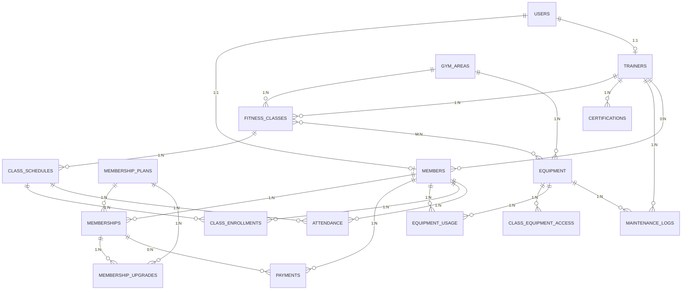

# GYM MANAGEMENT SYSTEM - ENTITY RELATIONSHIP DIAGRAM

## Complete ER Diagram (Detailed)



## Detailed Relationship Mapping

### Table: USERS
**Role**: Root authentication entity
**Primary Key**: user_id
**Related Tables**: 
- ➜ MEMBERS (1:1, CASCADE DELETE)
- ➜ TRAINERS (1:1, CASCADE DELETE)

```
USERS (13 columns)
├── Credentials: email, phone_number, password_hash
├── Profile: first_name, last_name
├── Classification: user_type (enum)
├── Status: account_status, email_verified, last_login_at
└── Audit: created_at, updated_at, deleted_at (soft delete)
```

---

### Table: MEMBERS
**Role**: Member-specific profile
**Primary Key**: member_id
**Foreign Keys**: 
- user_id → USERS (1:1, CASCADE)
- trainer_id → TRAINERS (N:1, SET NULL)

**Relationships**:
- N:1 → MEMBERSHIPS (member can have many memberships)
- N:1 → PAYMENTS (member makes many payments)
- N:1 → CLASS_ENROLLMENTS (member enrolls in many classes)
- N:1 → ATTENDANCE (member has many attendance records)
- N:1 → EQUIPMENT_USAGE (member uses equipment)

```
MEMBERS (20 columns)
├── Profile Link: user_id (FK) ➜ USERS
├── Personal: date_of_birth, gender, address, city, state, country
├── Emergency: emergency_contact_name, emergency_contact_phone
├── Health: medical_conditions, fitness_goals
├── Gym Specific: membership_start_date, total_classes_attended, preferred_class_time
├── Assignment: trainer_id (FK) ➜ TRAINERS
├── Media: profile_photo_url
└── Audit: created_at, updated_at
```

---

### Table: MEMBERSHIP_PLANS
**Role**: Subscription package definitions
**Primary Key**: plan_id
**Related Tables**: 
- ➜ MEMBERSHIPS (1:N, RESTRICT DELETE)
- ➜ MEMBERSHIP_UPGRADES (1:N, RESTRICT DELETE)

```
MEMBERSHIP_PLANS (13 columns)
├── Identification: plan_name (UNIQUE), description
├── Pricing: price_per_month, price_per_year
├── Duration: duration_months
├── Features: access_to_gym, personal_training_sessions, includes_nutrition_plan
├── Restrictions: max_classes_per_week, max_class_capacity
├── Policy: cancellation_notice_days
└── Status: is_active, created_at, updated_at
```

---

### Table: MEMBERSHIPS
**Role**: Track active and historical subscriptions
**Primary Key**: membership_id
**Foreign Keys**: 
- member_id → MEMBERS (N:1, CASCADE)
- plan_id → MEMBERSHIP_PLANS (N:1, RESTRICT)

**Relationships**:
- 1:N → MEMBERSHIP_UPGRADES (membership has many upgrade records)
- N:1 → PAYMENTS (membership receives payments)

```
MEMBERSHIPS (13 columns)
├── References: member_id (FK), plan_id (FK)
├── Lifecycle: start_date, end_date, renewal_date
├── Status: status (enum), auto_renewal
├── Cancellation: cancellation_reason, cancelled_by_user
├── Financial: total_price, amount_paid
├── Usage: classes_used_this_month
└── Audit: created_at, updated_at
```

**Key Relationships**:
```
User → Member (1:1) → Memberships (1:N) ← Plans
                    ↓
                  Payments (1:N)
```

---

### Table: MEMBERSHIP_UPGRADES
**Role**: Historical record of membership changes
**Primary Key**: upgrade_id
**Foreign Keys**: 
- membership_id → MEMBERSHIPS (N:1, CASCADE)
- old_plan_id → MEMBERSHIP_PLANS (N:1, RESTRICT)
- new_plan_id → MEMBERSHIP_PLANS (N:1, RESTRICT)

```
MEMBERSHIP_UPGRADES (10 columns)
├── References: membership_id (FK), old_plan_id (FK), new_plan_id (FK)
├── Pricing: old_price_monthly, new_price_monthly, price_difference
├── Adjustment: adjustment_amount
├── Classification: upgrade_type (enum: upgrade/downgrade/lateral)
├── Timeline: upgrade_date
└── Audit: created_at
```

**Purpose**: Track all plan changes for audit and analytics

---

### Table: TRAINERS
**Role**: Trainer-specific professional information
**Primary Key**: trainer_id
**Foreign Keys**: 
- user_id → USERS (1:1, CASCADE)

**Relationships**:
- 1:N → FITNESS_CLASSES (trainer conducts many classes)
- 1:N → CERTIFICATIONS (trainer has many certifications)
- 1:N → MAINTENANCE_LOGS (trainer performs maintenance)
- 0:N → MEMBERS (trainer coaches many members)

```
TRAINERS (11 columns)
├── Profile Link: user_id (FK) ➜ USERS
├── Expertise: specialization, years_of_experience, qualification_summary
├── Professional: bio, hourly_rate
├── Status: availability_status
├── Clients: total_clients, max_clients
├── Media: profile_photo_url
└── Audit: created_at, updated_at
```

---

### Table: CERTIFICATIONS
**Role**: Track trainer qualifications and credentials
**Primary Key**: certification_id
**Foreign Keys**: 
- trainer_id → TRAINERS (N:1, CASCADE)

```
CERTIFICATIONS (10 columns)
├── Reference: trainer_id (FK)
├── Credential: certification_name, certification_number (UNIQUE)
├── Issuing: issuing_organization
├── Validity: issue_date, expiration_date
├── Document: document_url
├── Status: is_active
└── Audit: created_at, updated_at
```

**Purpose**: Maintain credential audit trail and expiry tracking

---

### Table: GYM_AREAS
**Role**: Physical facility zones
**Primary Key**: area_id
**Related Tables**: 
- ➜ FITNESS_CLASSES (1:N, RESTRICT)
- ➜ EQUIPMENT (1:N, RESTRICT)

```
GYM_AREAS (6 columns)
├── Identification: area_name (UNIQUE), description
├── Capacity: capacity
├── Inventory: equipment_count
├── Status: is_active
└── Audit: created_at, updated_at
```

**Examples**: "Cardio Room", "Weight Room", "Yoga Studio", "Pool Area"

---

### Table: FITNESS_CLASSES
**Role**: Class type definitions
**Primary Key**: class_id
**Foreign Keys**: 
- trainer_id → TRAINERS (N:1, RESTRICT)
- area_id → GYM_AREAS (N:1, RESTRICT)

**Relationships**:
- 1:N → CLASS_SCHEDULES (class has many schedule instances)
- M:N ↔ EQUIPMENT (via CLASS_EQUIPMENT_ACCESS)

```
FITNESS_CLASSES (15 columns)
├── References: trainer_id (FK), area_id (FK)
├── Identification: class_name, description
├── Classification: category (enum), difficulty_level
├── Capacity: max_capacity, current_enrollment
├── Duration: duration_minutes
├── Scheduling: class_type (enum)
├── Availability: status (enum)
├── Pricing: price_per_session
├── Restrictions: min_age, max_age
├── Equipment: requires_equipment
├── Notes: notes
└── Audit: created_at, updated_at
```

**Example Classes**: Morning Yoga, Weight Training, Spin, Boxing, Pilates

---

### Table: CLASS_SCHEDULES
**Role**: Scheduled instances of fitness classes
**Primary Key**: schedule_id
**Foreign Keys**: 
- class_id → FITNESS_CLASSES (N:1, CASCADE)

**Relationships**:
- 1:N → CLASS_ENROLLMENTS (schedule has many enrollments)
- 1:N → ATTENDANCE (schedule has many attendance records)

```
CLASS_SCHEDULES (10 columns)
├── Reference: class_id (FK)
├── Timing: day_of_week, start_time, end_time, scheduled_date
├── Cancellation: is_cancelled, cancellation_reason
├── Enrollment: current_enrollment, waiting_list_count
└── Audit: created_at, updated_at
```

**Example**: "Morning Yoga on Monday 6:00 AM - 7:00 AM"

---

### Table: CLASS_ENROLLMENTS (JUNCTION TABLE)
**Role**: M:N relationship → Members ↔ Class Schedules
**Primary Key**: enrollment_id
**Composite Unique Key**: (member_id, schedule_id)

**Foreign Keys**: 
- member_id → MEMBERS (N:M, CASCADE)
- schedule_id → CLASS_SCHEDULES (M:N, CASCADE)

```
CLASS_ENROLLMENTS (9 columns)
├── References: member_id (FK), schedule_id (FK)
├── Status: enrollment_status (enrolled/waiting_list/cancelled/completed)
├── Timeline: enrollment_date, cancelled_date
├── Metadata: enrolled_by_trainer, cancellation_reason
└── Audit: created_at, updated_at
```

**Relationship Cardinality**:
```
Members (N) ─────┬───── CLASS_ENROLLMENTS ─────┬───── Class Schedules (M)
                  │      (Junction Table)       │
                  └─ Unique per member/schedule
```

---

### Table: ATTENDANCE
**Role**: Track actual class attendance
**Primary Key**: attendance_id
**Composite Unique Key**: (member_id, schedule_id)

**Foreign Keys**: 
- member_id → MEMBERS (N:1, CASCADE)
- schedule_id → CLASS_SCHEDULES (N:1, CASCADE)

```
ATTENDANCE (9 columns)
├── References: member_id (FK), schedule_id (FK)
├── Timing: check_in_time, check_out_time
├── Duration: duration_minutes
├── Status: attendance_status (present/absent/late/cancelled)
├── Metadata: marked_by_trainer, notes
└── Audit: created_at, updated_at
```

**Key Difference from ENROLLMENT**:
```
ENROLLMENT                           ATTENDANCE
├── Intent to participate            ├── Actual participation
├── Created when member enrolls      ├── Created when member checks in
├── Status: enrolled/waiting         ├── Status: present/absent/late
└── Cancelled reason (if dropped)    └── Time spent (if attended)
```

---

### Table: EQUIPMENT
**Role**: Inventory tracking
**Primary Key**: equipment_id
**Foreign Keys**: 
- area_id → GYM_AREAS (N:1, RESTRICT)
- responsible_trainer_id → TRAINERS (N:1, SET NULL)

**Relationships**:
- N:M ↔ FITNESS_CLASSES (via CLASS_EQUIPMENT_ACCESS)
- 1:N → EQUIPMENT_USAGE
- 1:N → MAINTENANCE_LOGS

```
EQUIPMENT (18 columns)
├── References: area_id (FK), responsible_trainer_id (FK)
├── Identification: equipment_name, equipment_type, serial_number (UNIQUE)
├── Description: description
├── Acquisition: purchase_date, purchase_cost, warranty_expiry_date
├── Condition: condition_status, operational_status
├── Maintenance: last_maintenance_date, next_maintenance_date, maintenance_interval_days
├── Capacity: max_weight_capacity
├── Usage: usage_count
└── Audit: created_at, updated_at
```

**Examples**: Treadmill, Dumbbell Set, Yoga Mat, Elliptical Machine

---

### Table: CLASS_EQUIPMENT_ACCESS (JUNCTION TABLE)
**Role**: M:N relationship → Fitness Classes ↔ Equipment

**Foreign Keys**: 
- class_id → FITNESS_CLASSES (N:M, CASCADE)
- equipment_id → EQUIPMENT (M:N, CASCADE)

```
CLASS_EQUIPMENT_ACCESS (5 columns)
├── References: class_id (FK), equipment_id (FK)
├── Requirement: equipment_required (boolean)
├── Quantity: quantity_needed
└── Audit: created_at
```

**Purpose**: Define which equipment is available/required for each class

---

### Table: EQUIPMENT_USAGE
**Role**: Log equipment usage and maintenance events
**Primary Key**: usage_id
**Foreign Keys**: 
- equipment_id → EQUIPMENT (N:1, CASCADE)
- member_id → MEMBERS (N:1, SET NULL) - Optional (for maintenance events)

```
EQUIPMENT_USAGE (9 columns)
├── References: equipment_id (FK), member_id (FK, optional)
├── Type: usage_type (training/maintenance/repair/inspection/cleaning)
├── Timing: start_time, end_time, duration_minutes
├── Status: usage_status (in_progress/completed/cancelled)
├── Notes: notes
└── Audit: created_at, updated_at
```

**Dual Purpose**:
1. **Training Usage**: Member using equipment (member_id NOT NULL)
2. **Maintenance Usage**: Maintenance or repair (member_id NULL)

---

### Table: MAINTENANCE_LOGS
**Role**: Detailed maintenance history
**Primary Key**: maintenance_id
**Foreign Keys**: 
- equipment_id → EQUIPMENT (N:1, CASCADE)
- trainer_id → TRAINERS (N:1, SET NULL)

```
MAINTENANCE_LOGS (11 columns)
├── References: equipment_id (FK), trainer_id (FK)
├── Type: maintenance_type (preventive/corrective/emergency/inspection)
├── Description: maintenance_description, parts_replaced
├── Cost: maintenance_cost
├── Timeline: maintenance_date, next_scheduled_date
├── Status: completion_status (pending/in_progress/completed/cancelled)
├── Notes: notes
└── Audit: created_at, updated_at
```

**Relationship with EQUIPMENT**:
```
EQUIPMENT last_maintenance_date ──→ Most recent entry in MAINTENANCE_LOGS
          next_maintenance_date ──→ Scheduled next entry
```

---

### Table: PAYMENTS
**Role**: Financial transaction tracking
**Primary Key**: payment_id
**Foreign Keys**: 
- member_id → MEMBERS (N:1, CASCADE)
- membership_id → MEMBERSHIPS (N:1, SET NULL)

```
PAYMENTS (16 columns)
├── References: member_id (FK), membership_id (FK, optional)
├── Type: payment_type (membership_fee/renewal/class_fee/training/other)
├── Amount: amount (CHECK > 0)
├── Method: payment_method (credit_card/debit_card/bank_transfer/cash/digital)
├── Status: payment_status (pending/completed/failed/refunded/cancelled)
├── IDs: transaction_id (UNIQUE), reference_number (UNIQUE)
├── Timeline: payment_date, due_date
├── Refund: refund_date, refund_amount, refund_reason
├── Notes: notes
└── Audit: created_at, updated_at
```

**Financial Flow**:
```
Member → Chooses Membership Plan → Creates Membership Record
  ↓
  Creates PAYMENT Record
  ├── payment_type: 'membership_fee'
  ├── amount: plan.price_per_month
  ├── payment_status: 'completed'
  └── Recorded for reporting/analytics
```

---

## Relationship Cardinality Summary

| From | Relationship | To | Cascade Rule |
|------|--------------|-----|-------------|
| USERS | 1:1 | MEMBERS | CASCADE DELETE |
| USERS | 1:1 | TRAINERS | CASCADE DELETE |
| MEMBERS | N:1 | TRAINERS | SET NULL |
| MEMBERS | 1:N | MEMBERSHIPS | CASCADE DELETE |
| MEMBERS | 1:N | PAYMENTS | CASCADE DELETE |
| MEMBERS | 1:N | CLASS_ENROLLMENTS | CASCADE DELETE |
| MEMBERS | 1:N | ATTENDANCE | CASCADE DELETE |
| MEMBERS | 1:N | EQUIPMENT_USAGE | SET NULL |
| MEMBERSHIP_PLANS | 1:N | MEMBERSHIPS | RESTRICT DELETE |
| MEMBERSHIPS | 1:N | MEMBERSHIP_UPGRADES | CASCADE DELETE |
| MEMBERSHIPS | 1:N | PAYMENTS | SET NULL |
| TRAINERS | 1:N | FITNESS_CLASSES | RESTRICT DELETE |
| TRAINERS | 1:N | CERTIFICATIONS | CASCADE DELETE |
| TRAINERS | 1:N | MAINTENANCE_LOGS | SET NULL |
| GYM_AREAS | 1:N | FITNESS_CLASSES | RESTRICT DELETE |
| GYM_AREAS | 1:N | EQUIPMENT | RESTRICT DELETE |
| FITNESS_CLASSES | 1:N | CLASS_SCHEDULES | CASCADE DELETE |
| FITNESS_CLASSES | M:N | EQUIPMENT | Via CLASS_EQUIPMENT_ACCESS |
| CLASS_SCHEDULES | 1:N | CLASS_ENROLLMENTS | CASCADE DELETE |
| CLASS_SCHEDULES | 1:N | ATTENDANCE | CASCADE DELETE |
| EQUIPMENT | 1:N | EQUIPMENT_USAGE | CASCADE DELETE |
| EQUIPMENT | 1:N | MAINTENANCE_LOGS | CASCADE DELETE |

---

## Data Dependencies & Flow

### User Registration Flow
```
USER (Created)
  ↓
USER → MEMBERS (or TRAINERS)
  ↓
MEMBERS → MEMBERSHIPS
  ↓
MEMBERSHIPS → PAYMENTS
```

### Class Attendance Flow
```
FITNESS_CLASSES → CLASS_SCHEDULES
  ↓
CLASS_SCHEDULES → CLASS_ENROLLMENTS (Member enrolls)
  ↓
CLASS_SCHEDULES → ATTENDANCE (Member checks in)
  ↓
MEMBERS (total_classes_attended incremented)
```

### Equipment Maintenance Flow
```
GYM_AREAS → EQUIPMENT
  ↓
EQUIPMENT → next_maintenance_date (calculated)
  ↓
MAINTENANCE_LOGS (maintenance scheduled)
  ↓
MAINTENANCE_LOGS → EQUIPMENT (update last/next dates)
```

---

## Views (Derived From Tables)

### View 1: v_active_memberships
```sql
SELECT member info, membership status, days until expiry
FROM memberships
WHERE status = 'active' AND end_date >= CURDATE()
```

### View 2: v_trainer_schedule
```sql
SELECT trainer, class name, schedule times, availability slots
FROM trainers → fitness_classes → class_schedules
WHERE classes.status = 'active'
```

### View 3: v_member_attendance_stats
```sql
SELECT member info, attendance count, avg duration, last class date
FROM members → attendance
GROUP BY member_id
```

### View 4: v_equipment_maintenance_due
```sql
SELECT equipment needing maintenance within 30 days
FROM equipment
WHERE next_maintenance_date <= DATE_ADD(CURDATE(), INTERVAL 30 DAY)
```

### View 5: v_revenue_summary
```sql
SELECT monthly revenue by payment type with aggregates
FROM payments
GROUP BY month, payment_type
```

---

## Conclusion

This ER diagram illustrates a **comprehensive, well-normalized relational schema** that:
- ✅ Eliminates data redundancy (3NF compliant)
- ✅ Maintains referential integrity (proper FKs and constraints)
- ✅ Supports all gym management operations
- ✅ Provides audit trails (timestamps, soft deletes)
- ✅ Enables complex reporting (views)
- ✅ Scales to support 1000+ members and trainers

All relationships are explicitly defined with appropriate cascade rules to ensure data consistency while protecting critical business records.

---

**Diagram Version**: 1.0  
**Last Updated**: March 14, 2024  
**Status**: ✅ Complete
